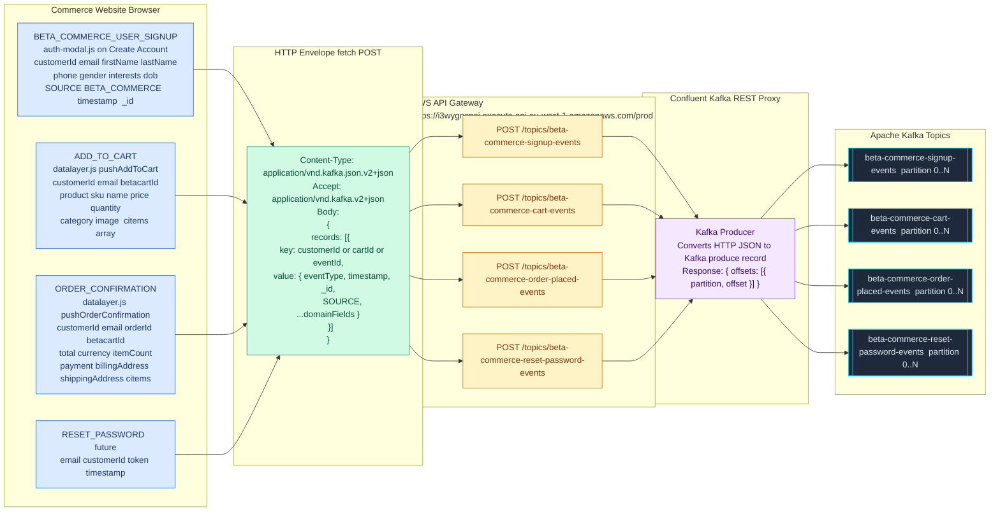
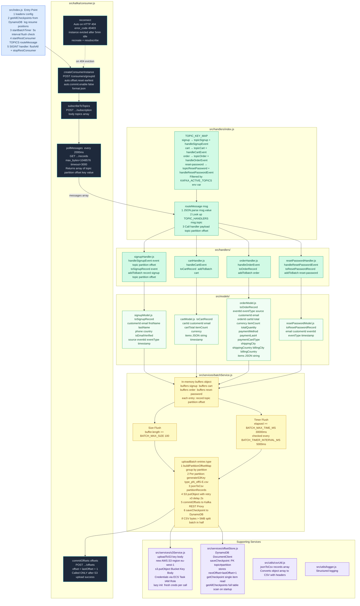
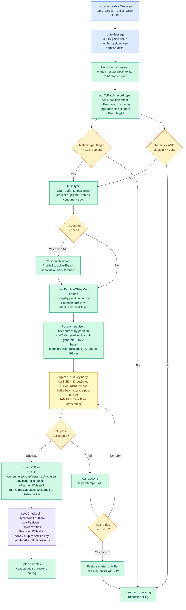
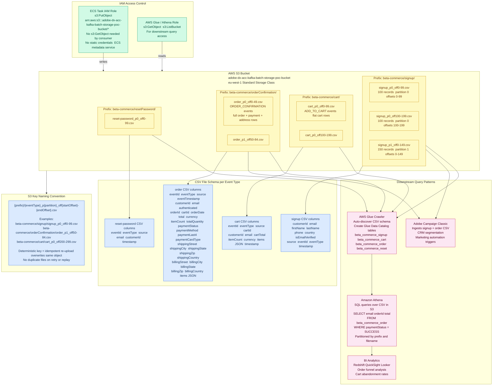
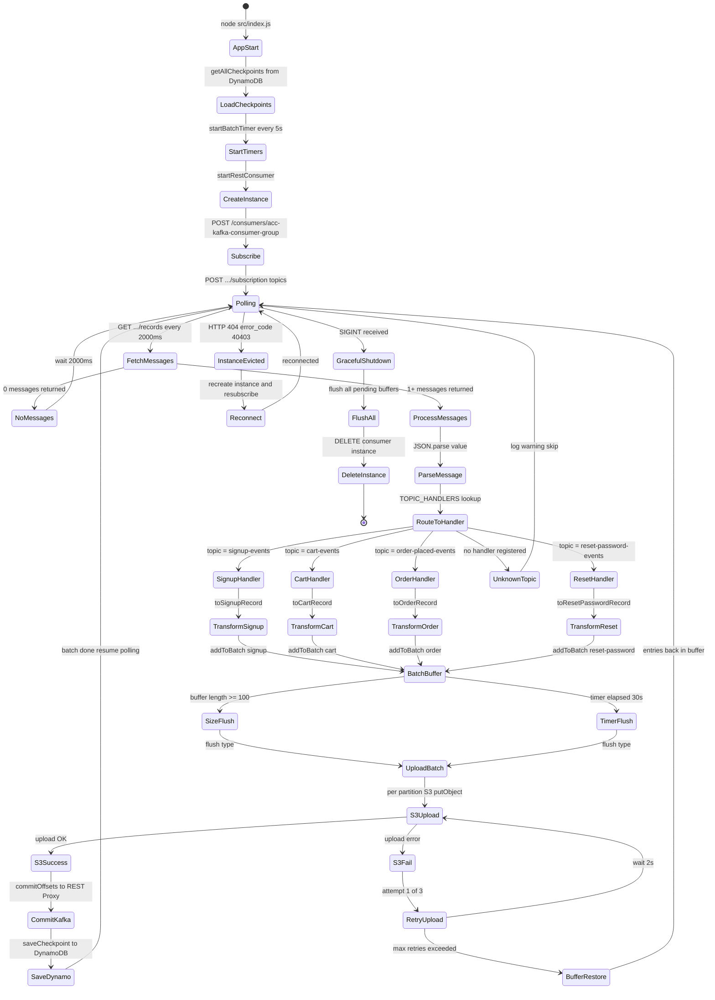

## 5. Producer Flow — Frontend to Kafka

How the Commerce Website publishes events to Kafka via the AWS API Gateway REST Proxy facade.



---

## 6. Consumer Application Internal Architecture

The Node.js application running inside the ECS Fargate task — module-level view.



---

## 7. Batch Processing and S3 Upload Flow

Detailed flow of how records are buffered, flushed, converted to CSV, and uploaded to S3 with Kafka commit and DynamoDB checkpoint.



---

## 8. AWS S3 Storage Architecture

How data is organised inside the S3 bucket, the key naming convention, and downstream access patterns.



---

## 9. Crash Recovery — DynamoDB Offset Checkpoint Flow

How the system guarantees **at-least-once delivery** and safe crash recovery using DynamoDB as a durable checkpoint store alongside Kafka manual offset commits.

```mermaid
flowchart TD
    subgraph WRITE["Normal Operation  After Each Batch Upload"]
        direction LR
        W1["S3 putObject succeeds\nbeta-commerce/signup/signup_p0_off100-199.csv"]
        W2["commitOffsets to Kafka REST Proxy\noffset = 200\nmarks p0 at 199 as consumed in broker"]
        W3["saveCheckpoint to DynamoDB\ntopicPartition: beta-commerce-signup-events#0\noffset: 200  s3Key: signup_p0_off100-199.csv\nupdatedAt: ISO timestamp"]
        W1 --> W2 --> W3
    end

    subgraph CRASH["Crash Scenario"]
        C1["ECS Task crashes or restarts\nIn-memory buffer LOST\nKafka offsets may or may not be committed"]
        C2["New ECS Task starts\nsrc/index.js runs getAllCheckpoints\nDynamoDB scan of kafka-consumer-offsets table"]
        C3["Checkpoint found:\ntopicPartition: beta-commerce-signup-events#0\nnextOffset: 200\ns3Key: signup_p0_off100-199.csv"]
        C4["Consumer creates new instance\nKafka group committed offset = 200\nConsumer resumes from offset 200\nNo duplicates  no gaps"]
        C1 --> C2 --> C3 --> C4
    end

    subgraph NOCHECK["Fresh Start  No Checkpoint"]
        NC1["getAllCheckpoints returns empty map\nNo prior state in DynamoDB"]
        NC2["Consumer starts with auto.offset.reset=earliest\nConsumes from beginning of Kafka retention\nor from Kafka group committed offset if exists"]
        NC1 --> NC2
    end

    subgraph KAFKAONLY["Kafka Commit Fails but DynamoDB Succeeds"]
        K1["S3 upload succeeded\nKafka commitOffsets FAILED\ninstance may have been evicted"]
        K2["DynamoDB checkpoint STILL WRITTEN\nnextOffset = 200 stored durably"]
        K3["On restart: DynamoDB offset = 200\nConsumer resumes from 200\nAt-least-once guarantee preserved\nPossible duplicate if S3 key already exists\nidempotent overwrite handles it"]
        K1 --> K2 --> K3
    end

    classDef ok    fill:#d1fae5,stroke:#059669,color:#064e3b
    classDef crash fill:#fee2e2,stroke:#dc2626,color:#7f1d1d
    classDef fresh fill:#dbeafe,stroke:#2563eb,color:#1e3a5f
    classDef warn  fill:#fef3c7,stroke:#d97706,color:#78350f

    class W1,W2,W3 ok
    class C1,C2,C3,C4 crash
    class NC1,NC2 fresh
    class K1,K2,K3 warn
```



---

## 10. Message Processing State Machine

Full lifecycle of the consumer from startup through steady-state polling to graceful shutdown.



---

## 11. End-to-End Sequence Diagram

Step-by-step interaction between all system components for a complete message cycle.

```mermaid
sequenceDiagram
    autonumber
    participant FE as Commerce Website
    participant FB as Firebase Auth
    participant AGW as AWS API Gateway
    participant KRP as Kafka REST Proxy
    participant KFK as Apache Kafka
    participant ECS as ECS Task Consumer
    participant S3 as AWS S3
    participant DDB as AWS DynamoDB

    Note over FE,DDB: Sign Up — User creates account

    FE->>FB: createUserWithEmailAndPassword email password
    FB-->>FE: userCredential uid emailVerified
    FE->>AGW: POST /topics/beta-commerce-signup-events
    Note right of FE: { records:[{ value:{ eventType:BETA_COMMERCE_USER_SIGNUP, user:{...} } }] }
    AGW->>KRP: Forward HTTP request
    KRP->>KFK: Produce to signup-events topic
    KFK-->>KRP: ACK offset=5 partition=0
    KRP-->>AGW: HTTP 200 { offsets:[{ partition:0, offset:5 }] }
    AGW-->>FE: HTTP 200 OK

    Note over FE,DDB: Add to Cart — User clicks Add to Cart

    FE->>AGW: POST /topics/beta-commerce-cart-events
    Note right of FE: { records:[{ key:customerId, value:{ eventType:ADD_TO_CART, cart:{...} } }] }
    AGW->>KRP: Forward
    KRP->>KFK: Produce to cart-events topic
    KFK-->>KRP: ACK offset=12 partition=0
    KRP-->>FE: HTTP 200 OK

    Note over FE,DDB: Order Placed — Confirmation page loads

    FE->>AGW: POST /topics/beta-commerce-order-placed-events
    Note right of FE: { records:[{ key:customerId, value:{ eventType:ORDER_CONFIRMATION, order:{...} } }] }
    AGW->>KRP: Forward
    KRP->>KFK: Produce to order-placed-events
    KFK-->>KRP: ACK offset=7 partition=0
    KRP-->>FE: HTTP 200 OK

    Note over FE,DDB: Consumer Startup

    ECS->>KRP: POST /consumers/acc-kafka-consumer-group
    Note right of ECS: { auto.offset.reset:earliest, auto.commit.enable:false, format:json }
    KRP-->>ECS: { instance_id:inst-1, base_uri:... }
    ECS->>DDB: Scan kafka-consumer-offsets table
    DDB-->>ECS: checkpoints map { topic#partition: { offset, s3Key } }
    ECS->>KRP: POST .../inst-1/subscription
    Note right of ECS: { topics:[signup-events, cart-events, order-placed-events, reset-password-events] }
    KRP-->>ECS: HTTP 204 No Content

    Note over FE,DDB: Poll Loop every 2000ms

    loop Every 2000ms
        ECS->>KRP: GET .../inst-1/records?max_bytes=1048576&timeout=3000
        KRP->>KFK: Fetch from subscribed topics
        KFK-->>KRP: Messages array
        KRP-->>ECS: HTTP 200 [{ topic, partition, offset, key, value }]
        ECS->>ECS: routeMessage JSON.parse value
        ECS->>ECS: handler toXxxRecord flatten to CSV row
        ECS->>ECS: addToBatch record type topic partition offset

        alt Buffer full >= 100 OR timer elapsed >= 30s
            ECS->>ECS: flush type drain buffer jsonToCsv
            ECS->>S3: s3.putObject Bucket=adobe-dx-acc-kafka-batch-storage-poc-bucket Key=order_p0_off0-99.csv
            Note right of ECS: IAM Task Role credentials via ECS metadata service
            S3-->>ECS: HTTP 200 OK ETag
            ECS->>KRP: POST .../inst-1/offsets
            Note right of ECS: { offsets:[{ topic, partition, offset:100, metadata:s3-committed }] }
            KRP-->>ECS: HTTP 200 OK
            ECS->>DDB: putItem kafka-consumer-offsets
            Note right of ECS: topicPartition=beta-commerce-order-placed-events#0 offset=100 s3Key=order_p0_off0-99.csv
            DDB-->>ECS: HTTP 200 OK
        end
    end

    Note over ECS,KRP: Auto-Reconnect on Instance Eviction

    ECS->>KRP: GET /records
    KRP-->>ECS: HTTP 404 { error_code:40403 }
    ECS->>KRP: POST /consumers/acc-kafka-consumer-group
    KRP-->>ECS: { instance_id:inst-2 }
    ECS->>KRP: POST .../subscription topics
    KRP-->>ECS
