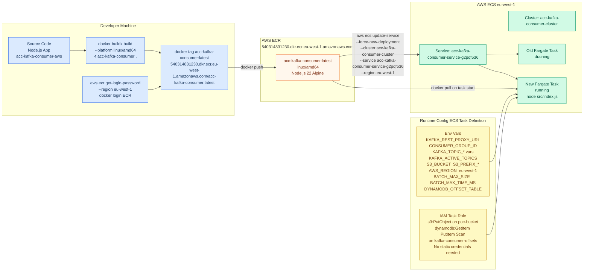
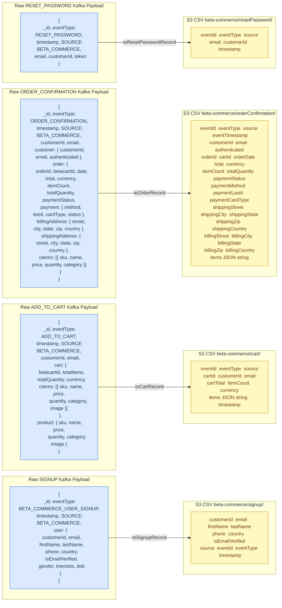

## 12. Deployment Pipeline

How the Docker image is built, pushed to ECR, and deployed to ECS Fargate.



---

## 13. Data Transformation — Event Types to S3 Schema

How each raw Kafka event payload is transformed and what the resulting CSV columns look like.



### S3 Key Naming Convention

```
{prefix}/{eventType}_p{partition}_off{startOffset}-{endOffset}.csv

Examples:
  beta-commerce/signup/signup_p0_off0-99.csv            (100 records, partition 0, offsets 0–99)
  beta-commerce/orderConfirmation/order_p1_off50-84.csv
  beta-commerce/cart/cart_p0_off200-299.csv

Key is DETERMINISTIC — re-uploading the same batch overwrites the same S3 object (idempotent replay).
```

---

## 14. Infrastructure and Component Reference Tables

### Component Registry

| Component | Technology | Details |
|---|---|---|
| **Commerce Website** | AEM EDS — Vanilla JS ESM blocks | `head.html` loads `scripts/scripts.js` which imports `datalayer.js`. Blocks decorated by AEM EDS framework |
| **scripts/config.js** | JS ES Module | Exports `firebaseConfig`, `KAFKA_REST_PROXY_BASE`, `KAFKA_SIGNUP_TOPIC`, `KAFKA_CART_TOPIC`, `KAFKA_ORDER_TOPIC` |
| **scripts/datalayer.js** | JS ES Module — `window.digitalData` | Event hub + Kafka publisher + Adobe Data Layer bridge. Hydrates from cookie + sessionStorage on every page load |
| **auth-modal.js** | AEM EDS Block | Firebase Auth sign-in / create account. Publishes `BETA_COMMERCE_USER_SIGNUP` to Kafka directly |
| **product-card.js** | AEM EDS Block | Add to Cart → `digitalData.pushAddToCart` → `publishCartEventToKafka` |
| **paymentmethods.js** | AEM EDS Block | Credit card form + Place Order → saves `lastOrder` to localStorage → redirect `/order-confirmation` |
| **order-confirmation.js** | AEM EDS Block | Reads `lastOrder`, awaits `digitalDataReady` + `adobeDataLayer` init, calls `pushOrderConfirmation` → Kafka |
| **Firebase Auth** | Google Cloud — Firebase SDK 10.12.2 | Email/password auth. UID used as identity anchor across all events |
| **Cloud Firestore** | Google Cloud — Firestore | User profiles stored in `users/{customerId}` document at signup |
| **AWS API Gateway** | REST API Facade | `https://i3wygncpai.execute-api.eu-west-1.amazonaws.com/prod` — eu-west-1 |
| **Confluent Kafka REST Proxy** | HTTP-to-Kafka Bridge | Handles producer (POST /topics) and consumer (GET /records) REST requests |
| **Apache Kafka Cluster** | Message Broker | 4 active topics — partitioned for parallelism |
| **AWS ECR** | Container Registry | `540314831230.dkr.ecr.eu-west-1.amazonaws.com/acc-kafka-consumer:latest` linux/amd64 |
| **AWS ECS Fargate** | Container Orchestration | Cluster: `acc-kafka-consumer-cluster` — Service: `acc-kafka-consumer-service-g2pqf536` |
| **Consumer App** | Node.js 22 | `node src/index.js` — polls Kafka REST Proxy every 2s, manual offset commit |
| **Batch Buffer** | In-memory (per event type) | Flush at 100 records OR 30s timeout — split if CSV > 5MB — retry 3× with 2s delay |
| **AWS S3** | Object Storage | `adobe-dx-acc-kafka-batch-storage-poc-bucket` — deterministic CSV keys, idempotent re-upload |
| **AWS DynamoDB** | Offset Checkpoint Store | Table: `kafka-consumer-offsets` — crash-safe resume, at-least-once delivery guarantee |
| **IAM Task Role** | AWS Auth | Grants `s3:PutObject` + DynamoDB `GetItem/PutItem/Scan` — no static credentials |

---

### Kafka Topic Registry

| Short Key | Kafka Topic Name | S3 Prefix | Triggered By | Handler File | Model File |
|---|---|---|---|---|---|
| `signup` | `beta-commerce-signup-events` | `beta-commerce/signup/` | `auth-modal.js` Create Account | `signupHandler.js` | `signupModel.js` |
| `cart` | `beta-commerce-cart-events` | `beta-commerce/cart/` | `datalayer.js` pushAddToCart | `cartHandler.js` | `cartModel.js` |
| `order` | `beta-commerce-order-placed-events` | `beta-commerce/orderConfirmation/` | `order-confirmation.js` pushOrderConfirmation | `orderHandler.js` | `orderModel.js` |
| `reset-password` | `beta-commerce-reset-password-events` | `beta-commerce/resetPassword/` | Future | `resetPasswordHandler.js` | `resetPasswordModel.js` |

---

### Browser Events Registry

| Event Type | Triggered By | Kafka Topic | Adobe Data Layer | digitalData.events |
|---|---|---|---|---|
| `PAGE_VIEW` | `datalayer.js` on DOMContentLoaded | — | ✅ pushed | ✅ appended |
| `BETA_COMMERCE_USER_SIGNUP` | `auth-modal.js` Create Account | `beta-commerce-signup-events` | ✅ pushed | ✅ appended |
| `BETA_COMMERCE_USER_LOGIN` | `auth-modal.js` Sign In | — | ✅ pushed | ✅ appended |
| `BETA_COMMERCE_USER_LOGOUT` | `auth-modal.js` Sign Out | — | — | ✅ appended |
| `ADD_TO_CART` | `product-card.js` Add to Cart click | `beta-commerce-cart-events` | ✅ pushed | ✅ appended |
| `CART_CLEAR` | `clearCart` CustomEvent | — | — | ✅ appended |
| `ORDER_PLACED` | `paymentmethods.js` Place Order | — | — | ✅ appended |
| `ORDER_CONFIRMATION` | `order-confirmation.js` page load | `beta-commerce-order-placed-events` | ✅ pushed | ✅ appended |

---

### Batch Configuration Reference

| Config Key | Env Var | Default | Description |
|---|---|---|---|
| `maxSize` | `BATCH_MAX_SIZE` | `100` | Records before size-based flush |
| `maxTimeMs` | `BATCH_MAX_TIME_MS` | `30000` | Milliseconds before time-based flush |
| `maxCsvSizeBytes` | `BATCH_MAX_CSV_SIZE_BYTES` | `5000000` | Max CSV size before splitting batch |
| `maxRetries` | `BATCH_MAX_RETRIES` | `3` | S3 upload retry attempts |
| `retryDelayMs` | `BATCH_RETRY_DELAY_MS` | `2000` | Delay between retries (ms) |
| `timerIntervalMs` | `BATCH_TIMER_INTERVAL_MS` | `5000` | How often the flush timer ticks (ms) |

---

### DynamoDB Table Schema — `kafka-consumer-offsets`

| Attribute | Type | Description |
|---|---|---|
| `topicPartition` | String (PK) | e.g. `beta-commerce-signup-events#0` |
| `topic` | String | Full Kafka topic name |
| `partition` | Number | Kafka partition number |
| `offset` | Number | **Next** offset to consume (lastOffset + 1) |
| `s3Key` | String | S3 object key of last successfully uploaded batch |
| `updatedAt` | String | ISO 8601 timestamp of last checkpoint write |

---

### AWS IAM Permissions Required (ECS Task Role)

```json
{
  "Version": "2012-10-17",
  "Statement": [
    {
      "Effect": "Allow",
      "Action": ["s3:PutObject"],
      "Resource": "arn:aws:s3:::adobe-dx-acc-kafka-batch-storage-poc-bucket/*"
    },
    {
      "Effect": "Allow",
      "Action": [
        "dynamodb:GetItem",
        "dynamodb:PutItem",
        "dynamodb:Scan"
      ],
      "Resource": "arn:aws:dynamodb:eu-west-1:540314831230:table/kafka-consumer-offsets"
    }
  ]
}
```

---

### Frontend Source File Map

```
acc-commerce-mock/
├── head.html                           CSP + module script tags
├── scripts/
│   ├── scripts.js                      AEM EDS page orchestrator — loadEager/loadLazy/loadDelayed
│   ├── aem.js                          AEM EDS core framework utilities
│   ├── config.js                       Firebase + Kafka endpoint constants
│   ├── datalayer.js                    window.digitalData — event hub + Kafka publisher + ACDL bridge
│   ├── delayed.js                      Non-critical deferred scripts (3s delay)
│   └── webpush.js                      Web Push notification support
├── blocks/
│   ├── auth-modal/
│   │   ├── auth-modal.js               Sign In + Create Account — Firebase Auth + Kafka SIGNUP
│   │   └── auth-modal.css
│   ├── header/
│   │   ├── header.js                   Navigation bar — triggers AuthModal.open
│   │   └── header.css
│   ├── product-card/
│   │   ├── product-card.js             Product display — Add to Cart → digitalData.pushAddToCart
│   │   └── product-card.css
│   ├── billingaddress/
│   │   ├── billingaddress.js           Billing address form + validation
│   │   └── billingaddress.css
│   ├── shippingaddress/
│   │   ├── shippingaddress.js          Shipping address form + same-as-billing toggle
│   │   └── shippingaddress.css
│   ├── paymentmethods/
│   │   ├── paymentmethods.js           Credit card form + Place Order — saves lastOrder → redirect
│   │   └── paymentmethods.css
│   └── order-confirmation/
│       ├── order-confirmation.js       Reads lastOrder — triggers ORDER_CONFIRMATION Kafka event
│       └── order-confirmation.css
└── styles/
    ├── styles.css                      Global styles
    ├── lazy-styles.css                 Non-critical styles loaded after LCP
    └── fonts.css                       Web font face declarations
```

### Consumer Source File Map

```
acc-kafka-consumer-aws/
├── src/
│   ├── index.js                        Entry — startup, DynamoDB resume, shutdown
│   ├── config/config.js                All config from env vars
│   ├── constants/eventTypes.js         Event type string constants
│   ├── kafka/consumer.js               REST Proxy client — poll, commit, reconnect
│   ├── handlers/
│   │   ├── index.js                    Topic → handler registry + routeMessage
│   │   ├── signupHandler.js            BETA_COMMERCE_USER_SIGNUP handler
│   │   ├── cartHandler.js              ADD_TO_CART handler
│   │   ├── orderHandler.js             ORDER_CONFIRMATION handler
│   │   └── resetPasswordHandler.js     RESET_PASSWORD handler
│   ├── models/
│   │   ├── signupModel.js              toSignupRecord — flatten to CSV row
│   │   ├── cartModel.js                toCartRecord
│   │   ├── orderModel.js               toOrderRecord
│   │   └── resetPasswordModel.js       toResetPasswordRecord
│   ├── services/
│   │   ├── batchService.js             In-memory buffer, flush logic, S3 upload orchestration
