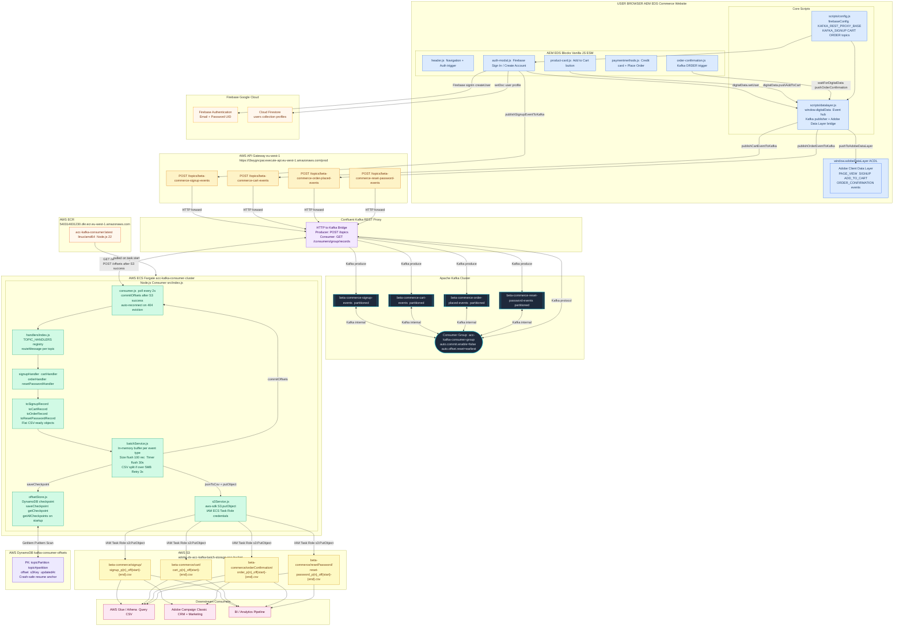
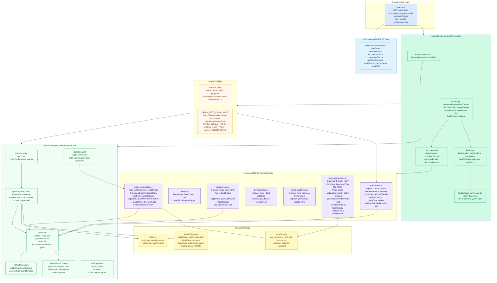

# ACC Commerce — Complete Full-Stack Architecture Document

> **System:** `acc-commerce-mock` (Frontend UI) + `acc-kafka-consumer-aws` (Backend Consumer)
> **Stack:** AEM EDS Commerce Website (Vanilla JS / AEM Blocks) → AWS API Gateway → Confluent Kafka REST Proxy → Apache Kafka → ECS Fargate (Node.js Consumer) → AWS S3 + AWS DynamoDB
> **Frontend Framework:** Adobe Experience Manager Edge Delivery Services (EDS) — Vanilla JS ESM blocks
> **Auth Provider:** Firebase Authentication + Firestore
> **Adobe Layer:** `window.adobeDataLayer` + `window.digitalData` (ACDL)
> **Region:** `eu-west-1` (AWS infrastructure)
> **Consumer Group:** `acc-kafka-consumer-group`
> **S3 Bucket:** `adobe-dx-acc-kafka-batch-storage-poc-bucket`

---

## Table of Contents

1. [Full End-to-End Architecture](#1-full-end-to-end-architecture)
2. [UI Frontend Architecture — AEM EDS Block System](#2-ui-frontend-architecture--aem-eds-block-system)
3. [User Journey and Event Trigger Flow](#3-user-journey-and-event-trigger-flow)
4. [DigitalData Layer — Internal Architecture](#4-digitaldata-layer--internal-architecture)
5. [Producer Flow — Frontend to Kafka](#5-producer-flow--frontend-to-kafka)
6. [Consumer Application Internal Architecture](#6-consumer-application-internal-architecture)
7. [Batch Processing and S3 Upload Flow](#7-batch-processing-and-s3-upload-flow)
8. [AWS S3 Storage Architecture](#8-aws-s3-storage-architecture)
9. [Crash Recovery — DynamoDB Offset Checkpoint Flow](#9-crash-recovery--dynamodb-offset-checkpoint-flow)
10. [Message Processing State Machine](#10-message-processing-state-machine)
11. [End-to-End Sequence Diagram](#11-end-to-end-sequence-diagram)
12. [Deployment Pipeline](#12-deployment-pipeline)
13. [Data Transformation — Event Types to S3 Schema](#13-data-transformation--event-types-to-s3-schema)
14. [Infrastructure and Component Reference Tables](#14-infrastructure-and-component-reference-tables)

---

## 1. Full End-to-End Architecture

Complete system view — from a user interaction on the AEM EDS Commerce Website through Firebase Auth, the `window.digitalData` datalayer, AWS API Gateway, Kafka, ECS Fargate Node.js consumer, to partitioned CSV files in AWS S3 with DynamoDB crash-safe checkpointing.



---

## 2. UI Frontend Architecture — AEM EDS Block System

How the AEM Edge Delivery Services frontend is structured — from HTML page load through script orchestration to block decoration.



---

## 3. User Journey and Event Trigger Flow

Full user journey from landing to order confirmation, showing which events fire at each step and which Kafka topics they land in.

```mermaid
flowchart LR
    subgraph STEP1["Step 1  Page Load"]
        PL1["Browser loads page\nscripts.js module executes\nimports datalayer.js"]
        PL2["hydrateFromCookie\nauth_user cookie → user node"]
        PL3["hydrateFromSession\nbetacartId + citems + orderConfirmation"]
        PL4["pushPageView\nPAGE_VIEW → adobeDataLayer"]
    end

    subgraph STEP2["Step 2  Sign Up"]
        AU1["Click Sign In button\nAuthModal.open create tab"]
        AU2["Fill form\nfirstName lastName email\npassword phone gender\ninterests dob"]
        AU3["Firebase createUserWithEmailAndPassword\n→ UID created"]
        AU4["Firestore setDoc\nusers/{numericCustomerId}"]
        AU5["publishSignupEventToKafka\nPOST beta-commerce-signup-events\neventType BETA_COMMERCE_USER_SIGNUP"]
        AU6["digitalData.setUser\nBETA_COMMERCE_USER_SIGNUP\n→ ACDL push"]
        AU7["setAuthCookie\nauth_user = uid email emailVerified"]
    end

    subgraph STEP3["Step 3  Add to Cart"]
        AC1["product-card block loaded\nSKU name price image from doc"]
        AC2["Click Add to Cart\ndigitalData.pushAddToCart item"]
        AC3["betacartId = CART-uuid\nsessionStorage digitalData_cartId\ncitems array updated"]
        AC4["publishCartEventToKafka\nPOST beta-commerce-cart-events\neventType ADD_TO_CART"]
        AC5["localStorage acc_commerce_cart\nitem persisted across navigation"]
    end

    subgraph STEP4["Step 4  Checkout"]
        CH1["Navigate /checkout\nbillingaddress shippingaddress\npaymentmethods blocks load"]
        CH2["Fill billing address\nstreet city state zip country"]
        CH3["Fill shipping address\nor toggle same as billing"]
        CH4["Fill credit card\nnumber expiry CVV name"]
        CH5["Click Place Order\nvalidateAll forms\ngenerateOrderId ORD-ts-rand"]
        CH6["localStorage lastOrder saved\nacc_commerce_cart cleared\nredirect /order-confirmation"]
    end

    subgraph STEP5["Step 5  Order Confirmation"]
        OC1["Browser loads /order-confirmation\norder-confirmation.js decorate"]
        OC2["Read lastOrder from localStorage"]
        OC3["Promise.all\nwaitForDigitalData 3s guard\nwaitForAdobeDataLayer 3s guard"]
        OC4["digitalData.pushOrderConfirmation\npublishOrderEventToKafka\nPOST beta-commerce-order-placed-events\neventType ORDER_CONFIRMATION"]
        OC5["Render order summary\norderId citems addresses payment"]
        OC6["sessionStorage digitalData_cartId cleared"]
    end

    PL1 --> PL2 --> PL3 --> PL4 --> AU1
    AU1 --> AU2 --> AU3
    AU3 --> AU4
    AU3 --> AU5
    AU3 --> AU6 --> AU7
    AU7 --> AC1 --> AC2 --> AC3 --> AC4
    AC3 --> AC5 --> CH1
    CH1 --> CH2 --> CH3 --> CH4 --> CH5 --> CH6
    CH6 --> OC1 --> OC2 --> OC3 --> OC4 --> OC5 --> OC6

    classDef s1 fill:#dbeafe,stroke:#2563eb,color:#1e3a5f
    classDef s2 fill:#d1fae5,stroke:#059669,color:#064e3b
    classDef s3 fill:#fef3c7,stroke:#d97706,color:#78350f
    classDef s4 fill:#ede9fe,stroke:#6d28d9,color:#2e1065
    classDef s5 fill:#fce7f3,stroke:#be185d,color:#500724

    class PL1,PL2,PL3,PL4 s1
    class AU1,AU2,AU3,AU4,AU5,AU6,AU7 s2
    class AC1,AC2,AC3,AC4,AC5 s3
    class CH1,CH2,CH3,CH4,CH5,CH6 s4
    class OC1,OC2,OC3,OC4,OC5,OC6 s5
```



---

## 4. DigitalData Layer — Internal Architecture

How `window.digitalData` is structured, initialised, and used by all blocks and scripts.

```mermaid
flowchart TD
    subgraph DL["window.digitalData  scripts/datalayer.js"]

        subgraph STATE["State  window.digitalData object"]
            S_USER["user\nauthenticated  customerId  email\nfirstName  lastName  phone\ngender  interests  dob  country\nisEmailVerified  source"]
            S_CART["cart\nbetacartId  citems array"]
            S_ORDER["orderConfirmation\norderId  betacartId  citems\ntotal  currency  billingAddress\nshippingAddress  payment  paymentStatus"]
            S_EVENTS["events  append-only array\neach event: eventId  eventType\nsource  timestamp  payload"]
        end

        subgraph INIT["Module Initialisation"]
            I1["hydrateFromCookie\nparse auth_user cookie\nrestore user.authenticated uid email\nisEmailVerified"]
            I2["hydrateFromSession\nrestore betacartId from digitalData_cartId\nrestore citems from digitalData_cartItems\nrestore orderConfirmation from digitalData_orderConfirmation\nmerge userProfile gender interests dob phone"]
            I3["dispatchEvent digitalDataReady\norder-confirmation.js awaits this with 3s timeout"]
            I4["pushPageView\nPAGE_VIEW event\npath url title name referrer language\nFires immediately if readyState != loading"]
        end

        subgraph API["Public API Methods"]
            API_SU["setUser userData\nMerge with sessionStorage userProfile\nPush BETA_COMMERCE_USER_LOGIN\nor BETA_COMMERCE_USER_SIGNUP\nsaveUserProfileToSession\npushEvent + pushToAdobeDataLayer"]
            API_CU["clearUser\nReset user to unauthenticated defaults\nPush BETA_COMMERCE_USER_LOGOUT\nclearUserProfileFromSession"]
            API_ATC["pushAddToCart item\nGenerate or restore betacartId CART-uuid\nIncrement quantity if SKU exists\nsaveCartToSession\nPush ADD_TO_CART event\npublishCartEventToKafka async"]
            API_CC["clearCart\nEmpty citems + betacartId\nPush CART_CLEAR\nsessionStorage cartId + cartItems removed"]
            API_OC["pushOrderConfirmation orderData\nResolve betacartId from orderData or _cartId\nBuild full orderConfirmation object\nsaveOrderConfirmationToSession\nPush ORDER_CONFIRMATION\npublishOrderEventToKafka async"]
            API_P["push event\nEnrich with timestamp\nAppend to events array\ndispatch digitalDataPush CustomEvent on window"]
        end

        subgraph KAFKA["Kafka Publishers  non-blocking async"]
            K_CART["publishCartEventToKafka item betacartId citems\nbuildCartEventPayload\neventType ADD_TO_CART  SOURCE BETA_COMMERCE\nPOST KAFKA_CART_REST_PROXY_URL\nFallback: if user unauthenticated\nread auth_user cookie for customerId email"]
            K_ORDER["publishOrderEventToKafka orderConfirmation\nbuildOrderEventPayload\neventType ORDER_CONFIRMATION  SOURCE BETA_COMMERCE\nPOST KAFKA_ORDER_REST_PROXY_URL\nFallback: use orderConfirmation.customer snapshot\nif digitalData.user still unauthenticated\nafter page navigation"]
        end

        subgraph ACDL["Adobe Data Layer Bridge"]
            ACDL_PUSH["pushToAdobeDataLayer eventObj\nwindow.adobeDataLayer.push\n{ event: eventType  ...eventObj }"]
            ACDL_WAIT["waitForAdobeDataLayer\nPromise resolved when ACDL initialised\nFast path: push !== Array.prototype.push\nSlow path: push resolver function into array\nSafety: 3s timeout if ACDL absent"]
        end

        subgraph LISTENERS["Global Event Listeners"]
            EV1["window authStateChanged\nFired by auth-modal on sign-in or sign-out\n→ setUser or clearUser"]
            EV2["window clearCart\nFired by any block needing cart reset\n→ clearCart"]
        end
    end

    subgraph CALLERS["Block Callers"]
        C_AUTH["auth-modal.js\npublishSignupEventToKafka directly\ndigitalData.setUser on signup\nsetAuthCookie"]
        C_PRODUCT["product-card.js\ndigitalData.pushAddToCart on button click"]
        C_ORDER["order-confirmation.js\nawait waitForDigitalData 3s\ndigitalData.pushOrderConfirmation order"]
        C_PAYMENT["paymentmethods.js\ndigitalData.push ORDER_PLACED\ncollects cart + address + payment\ngenerateOrderId"]
    end

    C_AUTH --> API_SU & K_CART
    C_PRODUCT --> API_ATC
    C_ORDER --> API_OC
    C_PAYMENT --> API_P

    API_ATC --> K_CART
    API_OC --> K_ORDER
    API_SU & API_ATC & API_OC & API_P --> ACDL_PUSH

    I1 & I2 --> I3 & I4
    EV1 --> API_SU & API_CU
    EV2 --> API_CC

    classDef state    fill:#dbeafe,stroke:#2563eb,color:#1e3a5f
    classDef init     fill:#e0f2fe,stroke:#0284c7,color:#0c4a6e
    classDef api      fill:#d1fae5,stroke:#059669,color:#064e3b
    classDef kafka    fill:#1e293b,stroke:#22d3ee,color:#e2e8f0
    classDef adobe    fill:#f3e8ff,stroke:#7c3aed,color:#3b0764
    classDef caller   fill:#fef9c3,stroke:#ca8a04,color:#713f12

    class S_USER,S_CART,S_ORDER,S_EVENTS state
    class I1,I2,I3,I4 init
    class API_SU,API_CU,API_ATC,API_CC,API_OC,API_P api
    class K_CART,K_ORDER kafka
    class ACDL_PUSH,ACDL_WAIT adobe
    class C_AUTH,C_PRODUCT,C_ORDER,C_PAYMENT caller
```



---

## 5. Producer Flow — Frontend to Kafka

How the Commerce Website publishes events to Kafka via the AWS API Gateway REST Proxy facade.

```mermaid
flowchart LR
    subgraph FE["Commerce Website  Browser"]
        EV1["BETA_COMMERCE_USER_SIGNUP\nauth-modal.js  Create Account submit\npublishSignupEventToKafka\ncustomerId email firstName lastName\nphone gender interests dob\neventType SOURCE timestamp _id"]
        EV2["ADD_TO_CART\ndatalayer.js  publishCartEventToKafka\neventType ADD_TO_CART  SOURCE BETA_COMMERCE\ncustomerId email betacartId\ncitems array  product sku name price\nquantity category image"]
        EV3["ORDER_CONFIRMATION\ndatalayer.js  publishOrderEventToKafka\neventType ORDER_CONFIRMATION  SOURCE BETA_COMMERCE\ncustomerId email orderId betacartId\ntotal currency itemCount\npayment billingAddress shippingAddress citems"]
        EV4["RESET_PASSWORD\n(future event type)\nemail customerId token timestamp"]
    end

    subgraph HTTP["HTTP Request Format"]
